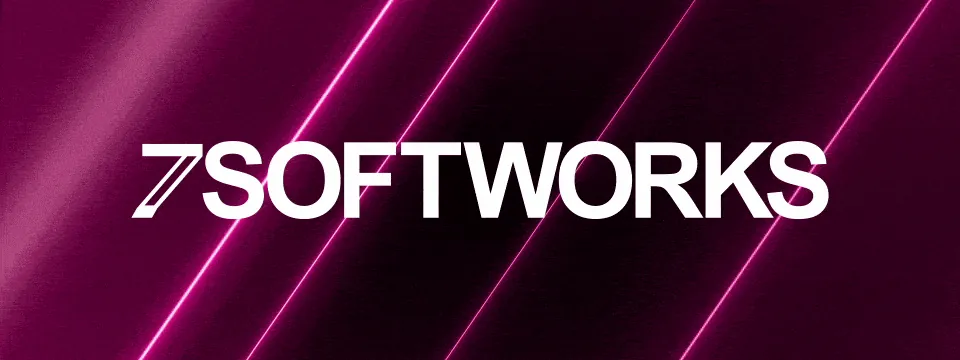

Sup nerd. I build Spicetify extensions, Blender tooling, and Windows automation scripts.

  
  
  

<picture><source media="(prefers-color-scheme: dark)" srcset="./assets/divider-dark.svg" /><source media="(prefers-color-scheme: light)" srcset="./assets/divider-light.svg" /></picture>

### ✦ Featured work

<a href="https://github.com/7xeh/SpicyLyricTranslator"><picture><source media="(prefers-color-scheme: dark)" srcset="./assets/cards/SpicyLyricTranslator-dark.svg" /><source media="(prefers-color-scheme: light)" srcset="./assets/cards/SpicyLyricTranslator-light.svg" /></picture></a>
<a href="https://github.com/7xeh/SpicyThemes"><picture><source media="(prefers-color-scheme: dark)" srcset="./assets/cards/SpicyThemes-dark.svg" /><source media="(prefers-color-scheme: light)" srcset="./assets/cards/SpicyThemes-light.svg" /></picture></a>
 
<a href="https://github.com/7xeh/SpotifyModernEQ"><picture><source media="(prefers-color-scheme: dark)" srcset="./assets/cards/SpotifyModernEQ-dark.svg" /><source media="(prefers-color-scheme: light)" srcset="./assets/cards/SpotifyModernEQ-light.svg" /></picture></a>
<a href="https://github.com/7xeh/QueueETA"><picture><source media="(prefers-color-scheme: dark)" srcset="./assets/cards/QueueETA-dark.svg" /><source media="(prefers-color-scheme: light)" srcset="./assets/cards/QueueETA-light.svg" /></picture></a>
 
<a href="https://github.com/7xeh/CarX-Blender-Tools"><picture><source media="(prefers-color-scheme: dark)" srcset="./assets/cards/CarX-Blender-Tools-dark.svg" /><source media="(prefers-color-scheme: light)" srcset="./assets/cards/CarX-Blender-Tools-light.svg" /></picture></a>

### ✦ Toolbox

  <picture><source media="(prefers-color-scheme: dark)" srcset="https://skillicons.dev/icons?i=ts%2Cjs%2Cpy%2Creact%2Ccss%2Cnodejs%2Cbun%2Cblender%2Cwindows%2Cpowershell%2Cvscode%2Cgit%2Cgithubactions%2Ccloudflare&theme=dark&perline=14" /><source media="(prefers-color-scheme: light)" srcset="https://skillicons.dev/icons?i=ts%2Cjs%2Cpy%2Creact%2Ccss%2Cnodejs%2Cbun%2Cblender%2Cwindows%2Cpowershell%2Cvscode%2Cgit%2Cgithubactions%2Ccloudflare&theme=light&perline=14" /></picture>

<picture><source media="(prefers-color-scheme: dark)" srcset="./assets/divider-dark.svg" /><source media="(prefers-color-scheme: light)" srcset="./assets/divider-light.svg" /></picture>

  Want to collaborate? Open an issue or PR on the relevant repo — that keeps the discussion next to the code. Anything else: <a href="mailto:7xeh@7xeh.dev">7xeh@7xeh.dev</a>

